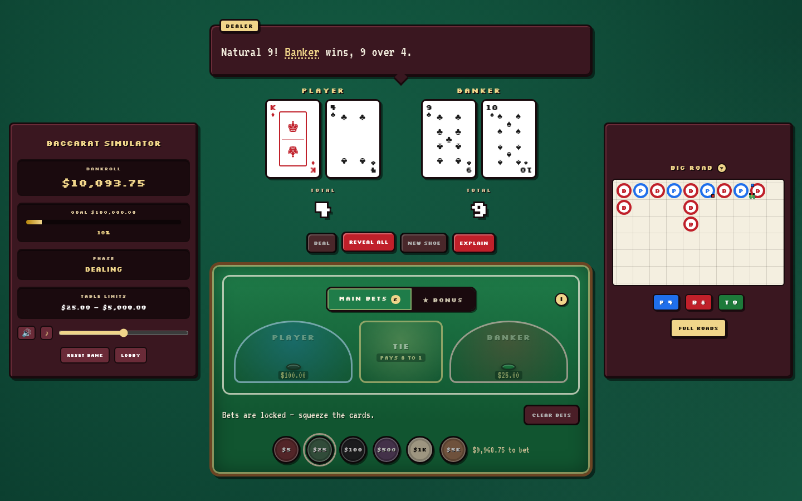
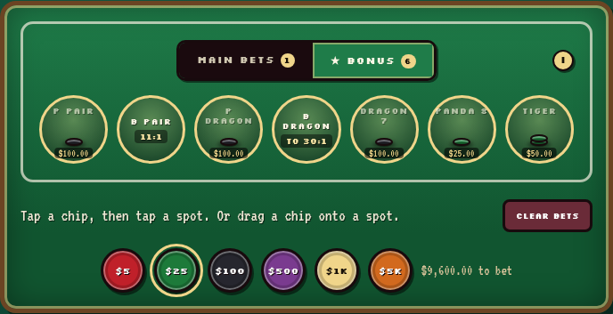
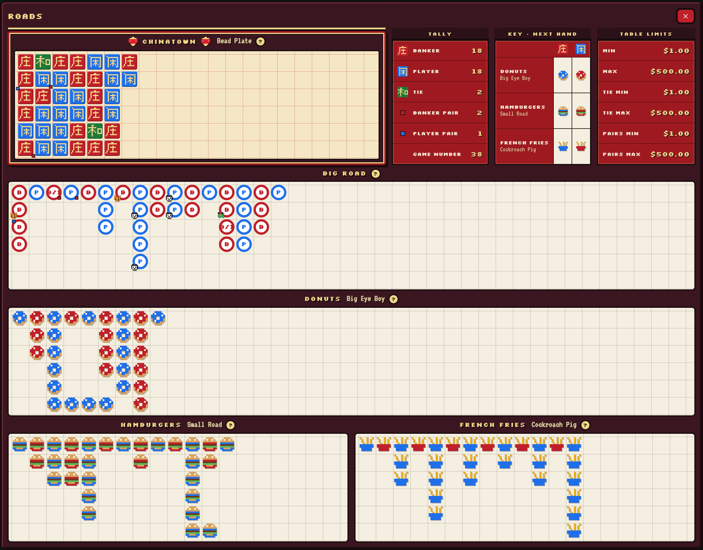
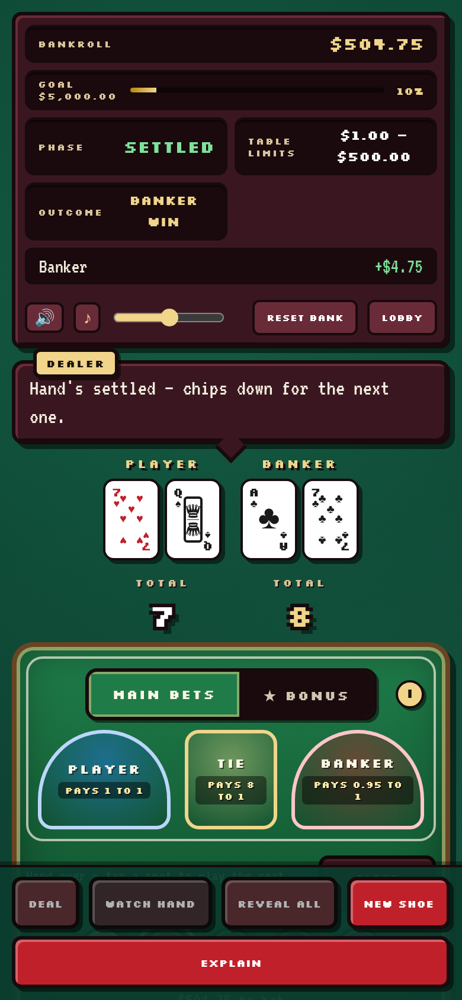

<div align="center">

# 🂡 Baccarat Simulator

**A Vegas-accurate Punto Banco table in the browser — with the part every other baccarat game skips: _the squeeze_.**

[**▶ Play it free**](https://baccarat-sim.com/) · [How to play](https://baccarat-sim.com/how-to-play/) · [Odds & house edge](https://baccarat-sim.com/baccarat-odds/) · [Roads explained](https://baccarat-sim.com/baccarat-roads/) · [License the engine](https://baccarat-sim.com/license/)

[](https://github.com/SabienNguyen/baccarat-sim/actions/workflows/deploy.yml)
[](#tests)
[](engine/)
[](LICENSE)

No sign-up. No download. No real money.



</div>

Bend the corner of the card with your mouse, watch the pip edges come up — _two
sides!_ — and let the dealer talk you through every draw, or ask him to turn his
own cards first. A chunky retro pixel look, a real chip economy, a Macau-style
scoreboard with all five roads, and a rules engine written in Rust, compiled to
WebAssembly, and **proven correct by exhaustive enumeration** rather than by
sampling.

## The game

- **Three tables, one ladder** — Low Stakes ($1–$500), Mid Roller ($25–$5k),
  High Roller ($500–$500k: the salon posts a limit bigger than the buy-in). Each
  has its own buy-in, its own chip set (the salon stocks $25k and $100k plates),
  and a **run goal**: beat the table by turning the buy-in into 10×. Each table's
  bankroll persists between visits.
- **The squeeze** — cards deal face down in real coup order (no third-card
  spoilers). Pinch the card anywhere and pull: the crease forms under your
  fingers and the card itself bends up off the felt, the genuine printed face
  riding the lifted flap upside down, near edge first — so a 9 reads as four legs
  up the long edge, exactly like paper.
- **Ask the dealer** — the high-limit courtesy: while you squeeze Player against
  a house-held Banker hand, _Flip one_ or _Flip both_ has the dealer turn his
  cards early, announced to the table.
- **A real chip economy** — your bankroll is physical chips in real casino
  colors. Pick up mixed stacks, drop them on the felt, and make change with the
  dealer (break plates down, color up, or just _get_ any chip you can cover).
  Banker-commission cents accumulate as loose change and mint back into chips.
- **The talking dealer** — narrates the action ("Monkey for the Player! Counts
  for nothing."), calls third cards with the tableau reason, refuses bad bets
  politely, and teaches the jargon: highlighted terms pop glossary definitions.
- **Sound** — a synthesized casino: chiptune table noise (chips, cards, squeezes,
  settles, the shuffle, dealer refusals, the bust dirge) over a floor-murmur
  ambience and an optional lounge loop, with a persisted volume control.
- **Explain mode** — see _why_ each third card was drawn, and the house edge of
  every bet you placed.
- **The roads** — the Big Road beside the table, and a full Macau-style
  scoreboard one click away.

### Ask the dealer

The ask is reveal-order only: it never touches a third card, and it only shows
while it would be honoured — your hand still down, the house's still face down
behind it. At a shared table the server validates the request and broadcasts
the dealer's call of the card that turned.

### The full bet menu

Player, Banker and Tie, plus Pairs, Dragon 7, Panda 8, Dragon Bonus on **both**
sides, and the Tiger family — every one documented in-game, with its odds a tap
away.



Chips stack into towers the way they do on a real felt, and a staked spot steps
its odds aside so the stack has room.

### Scoreboard roads

The Big Road sits beside the table like a pit display — pair dots and pixel-art
bonus tokens included. **Full roads** opens a Macau-style scoreboard: a
Chinatown bead plate with 庄 / 闲 / 和 pixel tiles, the Big Road with a six-row
dragon tail that bends long runs along the bottom row, and the three derived
roads drawn as food — donuts (Big Eye Boy), hamburgers
(Small Road), french fries (Cockroach Pig) — beside a tally, a key that
forecasts each derived road's mark for the next hand, and the table limits. The
board sizes itself to the viewport with no scrolling, and every road has an
explainer.



### Multiplayer

Public and private tables (6-character invite codes) on an authoritative Rust
server. Real squeeze rights: the biggest Player bettor holds the Player cards,
the biggest Banker bettor holds the Banker cards, and the house dealer turns any
hand nobody bet — one card per beat, announced. Only the holder gets the squeeze
gesture, peeks follow the ritual order, and the Player squeezer's flip request
is validated by the server before the table hears it. Every coup is opt-in: bet
or sit out, and the deal waits for the table.

Nobody can freeze the table: a squeezer whose connection drops has 8 seconds to
come back before the dealer turns that hand himself, and one who simply stops
squeezing loses it after a 45-second squeeze clock. Click your own seat to
change your name mid-session; the whole table sees it on the next push. Drop
your connection and your seat and bankroll are held for two minutes while the
client reconnects on its own. Single player runs the **same table rules** with
one seat.

**Spectator mode.** Any table can be watched from the rail — a full public
table from the lobby, a private one by its code, or straight from a
`?watch=CODE` link. A watcher sees exactly what the seats share (the felt, the
squeeze as it happens, the dealer's calls, the roads, who's holding which hand)
and nothing they don't: no peeked slivers, no chips, no bets. Watchers never
block a deal and never keep an empty table open; when the last seat leaves, the
rail is sent back to the lobby with a word. **Take a seat** sits a watcher down
in place — and on a full table they simply keep watching.

### On a phone

<div align="center">
  
</div>

## Fair by construction

Most casino games ask you to trust their paytables. This one ships the proof —
and you can re-run it in about three seconds:

```sh
cargo test -p baccarat-engine --test exact_enumeration -- --nocapture
```

That test walks **all 1,659,001 reachable coups** of a fresh 8-deck shoe, each
weighted by its exact hypergeometric probability. No Monte Carlo, no error bars.
It is self-checking in two ways that are hard to satisfy by accident:

- leaf probabilities sum to **0.999999999978** (f64 accumulation only), so the
  walk is a genuine partition of the sample space;
- the outcome frequencies come out **Player 44.624661% / Banker 45.859742% /
  Tie 9.515597%**, matching the canonical 8-deck figures to six decimals.

Every side-bet house edge lands within **0.0033pp** of published analysis, and
the paytables are cross-checked against regulator sources (Nevada GCB Rules of
Play, NJAC 13:69F) — which is how a retired 35:1 Tiger Tie paytable was caught
and corrected to 45:1.

The shoe itself is 8 decks shuffled with Fisher–Yates over a ChaCha-based CSPRNG
seeded from OS entropy, with the casino rituals modeled: a burn after every
shuffle and a cut card 14 from the back. A 200,000-coup statistical suite and a
uniformity test back it up. **A biased shuffle fails the build.**

## Architecture

```
engine/        Rust — the rules, incl. the multiplayer Table. Pure logic, no UI. 183 tests.
engine-wasm/   wasm-bindgen boundary: commands in, snapshots out.
server/        Rust — axum WebSocket table server. Authoritative shoe, rooms, invite codes. 33 tests.
web/           React + TypeScript — the whole table. 435 tests.
```

The engine knows nothing about rendering; the front-end contains zero game
logic. Everything the UI shows comes from engine snapshots, locally (wasm) or
over a WebSocket (the server) — the components can't tell the difference. The
server owns the shoe and every view it pushes is per-seat: a face-down card
never includes its rank, so nothing about the deck order ever reaches a client
that shouldn't see it.

## Running it

Prereqs: Rust (with the `wasm32-unknown-unknown` target),
[`wasm-pack`](https://rustwasm.github.io/wasm-pack/), Node 20+.

```sh
npm run build:wasm             # compile the engine to wasm (regenerates engine-wasm/pkg)
npm install
npm --workspace web run dev    # from the repo root
```

For multiplayer, run the table server alongside the dev server (Vite proxies
`/ws` to it):

```sh
cargo run -p baccarat-server   # listens on PORT (default 8788)
```

`npm run phones` opens several phone-emulated browser windows against your
local server for manual multiplayer testing — see
[`docs/TESTING.md`](docs/TESTING.md).

<details>
<summary><b>Deploying the table service</b></summary>

In production the server can serve the built site itself (`SPA_DIR`, default
`web/dist`). A `Dockerfile` is included, and it binds `0.0.0.0:$PORT`, so any
container host works unchanged.

**Render** (free tier, no card, WebSockets) — `render.yaml` is a ready blueprint:
point [a new Blueprint](https://dashboard.render.com/blueprint/new) at this
repository. A `fly.toml` is also included if you prefer Fly.io.

Then tell the site where the tables live. The Pages workflow builds against the
production Fly app, `wss://table.baccarat-sim.com/ws`, unless a repository
**variable** named `VITE_WS_URL` (Settings → Secrets and variables → Actions →
Variables) says otherwise — set it to `wss://<your-host>/ws` and multiplayer
changes hosts without a source change. The full cutover, DNS to certificates, is
in [`docs/DEPLOY.md`](docs/DEPLOY.md).

Rooms live in memory and one instance owns them, so keep the service pinned to a
single replica. Until it's deployed, the lobby says so plainly and single player
works untouched.

</details>

### Tests

```sh
cargo test                                  # engine + server, incl. statistical validation
npm --workspace web run test -- --run       # the web app
```

Every push runs both suites in CI and deploys the site to GitHub Pages.

## Status

Complete and playable, live at [baccarat-sim.com](https://baccarat-sim.com/)
with the table service on Fly at `table.baccarat-sim.com`. **Single player** —
three tables, win goals, bust-outs, persistent bankrolls, dealer flip requests,
the full roads board — and **multiplayer** — public/private rooms, authentic
squeeze rights, a paced house dealer, seats held through a disconnect, a squeeze
grace and clock so no one seat can stall a hand, and a table that deals on past
anyone out of chips.

As of 2026-09-10: `cargo test` 216 passed (5 ignored: informational tables and
a microbenchmark), `vitest` 435 passed. The site plays single player with no
server at all; if the table service is ever down, the lobby says so plainly.

## Using the engine

The engine is a standalone crate: pure logic, no I/O, no async, and it drives
both a browser and a server through the same code path.

MIT licensed — ship it commercially without asking. Commercial support (rule
variants, integration, a compliance audit report written for a certification
reader) is available at
[**/license/**](https://baccarat-sim.com/license/).
